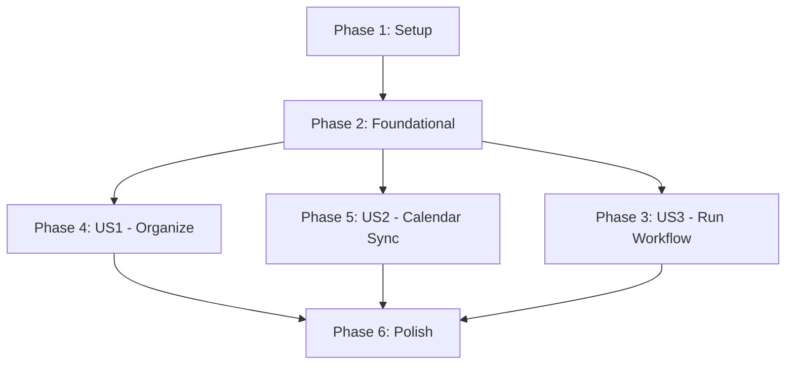

# Tasks: Repeat CLI

**Input**: Design documents from `.specify/specs/001-repeat-cli/`
**Prerequisites**: plan.md ✅, spec.md ✅

## Format: `[ID] [P?] [Story] Description`

- **[P]**: Can run in parallel (different files, no dependencies)
- **[Story]**: Which user story this task belongs to (e.g., US1, US2, US5)

---

## Phase 1: Setup

**Purpose**: Project initialization and basic structure

- [ ] T001 Initialize Go module with `go mod init github.com/jflowers/repeat`
- [ ] T002 [P] Create directory structure: `cmd/`, `internal/`, `pkg/`
- [ ] T003 [P] Create `.env.example` with required environment variables
- [ ] T004 [P] Create `Makefile` with build, test, and run targets
- [ ] T005 Add Cobra CLI dependency: `go get github.com/spf13/cobra`
- [ ] T006 Add Viper config dependency: `go get github.com/spf13/viper`

---

## Phase 2: Foundational (Blocking Prerequisites)

**Purpose**: Core infrastructure required before ANY user story

**⚠️ CRITICAL**: No user story work can begin until this phase is complete

- [ ] T007 Create `cmd/repeat/main.go` - CLI entry point with root command
- [ ] T008 Create `internal/config/config.go` - Configuration struct and loading
- [ ] T009 [P] Create `internal/config/env.go` - Environment variable handling
- [ ] T010 Create `internal/auth/oauth.go` - OAuth2 flow for Workspace APIs
- [ ] T011 [P] Create `internal/auth/gemini.go` - API key loading for Gemini
- [ ] T012 Create `pkg/models/document.go` - Document model struct
- [ ] T013 [P] Create `pkg/models/meeting.go` - Meeting folder model
- [ ] T014 Add Google API dependencies: `go get google.golang.org/api/...`
- [ ] T015 Add Gemini SDK: `go get google.golang.org/genai`
- [ ] T016 Add Charmbracelet dependencies: `go get github.com/charmbracelet/log github.com/charmbracelet/lipgloss github.com/charmbracelet/huh`

**Checkpoint**: Foundation ready - run `go build ./...` to verify

---

## Phase 3: User Story 3 - Run Full Workflow (Priority: P1) 🎯 MVP

**Goal**: Single command to execute complete workflow with --dry-run support

**Independent Test**: Run `repeat run --dry-run` and verify all steps logged

### Implementation for User Story 3

- [ ] T017 [US3] Add `run` subcommand to `cmd/repeat/main.go`
- [ ] T018 [US3] Create `internal/organizer/organizer.go` - Main Organizer struct with DryRun mode
- [ ] T019 [US3] Create `internal/organizer/workflow.go` - Workflow coordination logic
- [ ] T020 [US3] Add --dry-run and --verbose flags to root command
- [ ] T021 [US3] Implement progress output for long-running operations

**Checkpoint**: `repeat run --help` works, --dry-run flag available

---

## Phase 4: User Story 1 - Organize Meeting Documents (Priority: P1)

**Goal**: Scan Drive for meeting notes and organize into topic-based subfolders

**Independent Test**: Create test doc "Team Standup - 2026-01-30", run organize, verify folder created

### Implementation for User Story 1

- [ ] T022 [US1] Create `internal/drive/service.go` - Drive service initialization
- [ ] T023 [US1] Create `internal/drive/folder.go` - Folder creation and lookup
- [ ] T024 [US1] Create `internal/drive/shortcuts.go` - Shortcut creation for non-owned files
- [ ] T025 [US1] Add `organize` subcommand to CLI
- [ ] T026 [US1] Implement filename regex parsing (configurable pattern)
- [ ] T027 [US1] Implement file ownership check and conditional move/shortcut
- [ ] T028 [US1] Add unit tests for regex parsing in `internal/drive/folder_test.go`

**Checkpoint**: `repeat organize --dry-run` shows intended actions

---

## Phase 5: User Story 2 - Sync Calendar Attachments (Priority: P2)

**Goal**: Scan recent calendar events and sync attachments to meeting folders

**Independent Test**: Create calendar event with Drive attachment, run sync, verify shortcut created

### Implementation for User Story 2

- [ ] T029 [US2] Create `internal/calendar/service.go` - Calendar service initialization
- [ ] T030 [US2] Create `internal/calendar/attachments.go` - Attachment extraction
- [ ] T031 [US2] Implement Drive URL parsing from event descriptions
- [ ] T032 [US2] Add `sync-calendar` subcommand to CLI
- [ ] T033 [US2] Add --days flag (default: 8) for lookback period
- [ ] T034 [US2] Integrate with drive/shortcuts.go for shortcut creation
- [ ] T035 [US2] Add unit tests for URL parsing in `internal/calendar/attachments_test.go`

**Checkpoint**: `repeat sync-calendar --days 8 --dry-run` shows intended actions

## Phase 6: Polish & Cross-Cutting Concerns

**Purpose**: Improvements that affect multiple user stories

- [ ] T036 [P] Update README.md with usage examples and GIF/screenshot
- [ ] T037 [P] Create `docs/SETUP.md` with OAuth setup instructions
- [ ] T038 Implement exponential backoff for API rate limiting
- [ ] T039 [P] Add `auth login` subcommand for interactive OAuth flow
- [ ] T040 [P] Add `config show` subcommand to display merged configuration
- [ ] T041 Run `go vet ./...` and fix all warnings
- [ ] T042 Run `gofmt -w .` to format all code
- [ ] T043 Final integration test: full workflow with real APIs

---

## Dependencies & Execution Order

### Phase Dependencies

### Critical Path

1. **T001-T006**: Setup (required first)
2. **T007-T016**: Foundational (blocks all user stories)
3. **T017-T021**: US3 scaffold (enables testing other stories)
4. **T022-T028**: US1 (core organizing)
5. **T029-T035**: US2 (calendar sync)

### Parallel Opportunities

Once Phase 2 complete, these can run in parallel:
- US1 (T022-T028) and US2 (T029-T035) are independent
- Phase 3 (Run Workflow) provides the scaffold for testing both

---

## Notes

- All [P] tasks can run in parallel within their phase
- Test files should be created alongside implementation
- Commit after each task or logical group
- Use `--dry-run` extensively during development to avoid side effects
- OAuth tokens stored in `~/.repeat/token.json`
