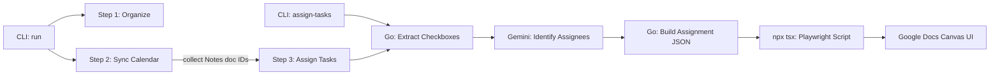

# Implementation Plan: Browser Automation for Task Assignment

## Overview

Implement browser automation using Playwright to assign tasks via Google Docs' native checkbox UI.

## Architecture

## Technology Choice: Playwright + tsx

**Why Playwright over Rod (Go)?**
- Better documentation and community
- More stable for complex web apps like Google Docs
- TypeScript API is mature for canvas-based UI interaction
- Can use persistent Chrome profile for auth

**Integration**: Go CLI executes Playwright script via `npx tsx assign-tasks.ts`

---

## Implementation (Completed)

### Component 1: Checkbox Extraction (Go)

#### [MODIFY] [service.go](file:///Users/jflowers/Projects/github/jflowers/repeat/internal/docs/service.go)
- `ExtractCheckboxItems()` reads doc via Google Docs API
- `extractParagraphText()` sanitizes control characters with `unicode.IsControl`/`IsPrint`
- Identifies "Suggested next steps" section and extracts checkbox items

#### [MODIFY] [client.go](file:///Users/jflowers/Projects/github/jflowers/repeat/internal/gemini/client.go)
- `ExtractAssigneesFromCheckboxes()` sends checkbox text to Gemini
- Returns structured assignments with assignee name, email, and text

---

### Component 2: Browser Automation (TypeScript)

#### [NEW] [browser/assign-tasks.ts](file:///Users/jflowers/Projects/github/jflowers/repeat/browser/assign-tasks.ts)
Playwright script that:
1. Opens Google Doc by ID using persistent Chrome profile
2. Navigates to "Suggested next steps" via Ctrl+F
3. For each assignment:
   - Dynamically increases search text until unique (1 of 1 match)
   - Uses Home/End to find line start position
   - Hover-then-detect at offset -35 for canvas widget tooltip
   - Clicks widget, fills assignee, confirms with Tab×3+Enter
4. Returns JSON results to stdout

#### [NEW] [browser/package.json](file:///Users/jflowers/Projects/github/jflowers/repeat/browser/package.json)
Dependencies: playwright, tsx, typescript

---

### Component 3: CLI Integration

#### [MODIFY] [main.go](file:///Users/jflowers/Projects/github/jflowers/repeat/cmd/repeat/main.go)
- `assign-tasks` standalone command with `--doc` flag
- `run` command integrates as Step 3: collects Notes doc IDs during calendar sync, scans each for unassigned checkboxes

#### [MODIFY] [organizer.go](file:///Users/jflowers/Projects/github/jflowers/repeat/internal/organizer/organizer.go)
- `notesDocIDs` map tracks Google Docs with "Notes" in title during calendar sync
- `GetNotesDocIDs()` returns collected doc IDs for Step 3
- `AddTaskStats()` and `PrintSummary()` for workflow summary

---

## Verification (Completed)

### Manual Verification ✅
1. `./repeat assign-tasks --doc <id>` — 4/4 assignments succeeded
2. Dynamic search expanded "Hannah Braswell will" (20 chars, 2 matches) to 30 chars (1 match)
3. All cursors at x=851, tooltips at offset -35, Tab×3+Enter confirmed
4. `--dry-run` mode shows planned assignments without browser

### Key Discoveries
- **Canvas Widget**: "Assign as a task" icon has zero DOM presence (canvas overlay)
- **803 vs 851**: Cursor X position distinguishes wrapped lines (803) from first lines (851)
- **Hidden Characters**: Google Docs API returns `\v`, zero-width spaces in `TextRun.Content`
- **Idempotency Barrier**: Already-assigned tasks show different widget behavior
