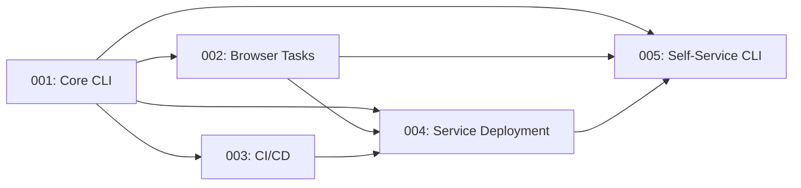

# Repeat — Spec Overview

| # | Spec | Status | Description |
|---|------|--------|-------------|
| 001 | [repeat-cli](./001-gcal-organizer-cli/) | ✅ Implemented | Core CLI: organize Drive docs, sync calendar attachments |
| 002 | [browser-task-assignment](./002-browser-task-assignment/) | ✅ Implemented | Playwright-based Google Docs checkbox assignment |
| 003 | [cicd-github-actions](./003-cicd-github-actions/) | ✅ Implemented | CI/CD: build/test on push, release on tag |
| 004 | [service-deployment](./004-service-deployment/) | ✅ Implemented | Hourly scheduling (launchd/systemd), Homebrew, man page |
| 005 | [self-service-cli](./005-self-service-cli/) | ✅ Implemented | `init`, `doctor`, `install`/`uninstall`, actionable errors |

## Dependency Graph

## Key Cross-References

- **002** depends on **001** for Docs API checkbox extraction and Gemini client
- **003** builds and tests the binary defined in **001**
- **004** deploys the binary from **001** + browser scripts from **002**, uses formula from **003**
- **005** provides `init`, `doctor`, `setup-browser` that bootstrap **001** and **002**
